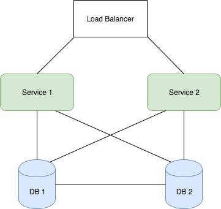

# TTp2
Topicos de Telematica Proyecto 2

By: Pablo Cano, Lope Carvajal

# Documento 1

### 1.1 Definición	del	Equipo,	Proyecto	y	Aplicación

##### 1.1.1 Asignación de QAs
  * Lope Carvajal -- Availability
  * Pablo Cano --  Performance
 
##### 1.1.2 Aplicación Seleccionada
Las dos aplicaciónes que estan corriendo en el servidor son muy similares, ambas utilizando node, express y mongoDB manejando imagenes por URL, asi que no existia mucha diferencia en la eleccicón y decidimos seguir la que mas trabajo adelantado tenía que era Campgrounds.  

##### 1.1.3 Descripción de la aplicación
Campgrounds es una aplicación sencilla de sitios de campamentos donde los usuarios pueden crear e ingresar a la plataforma con una cuenta personal. Cuando se ha ingresado, los usuarios pueden crear un campamento para mostrar y asociarle una image. Los usuarios tambien pueden comentar en todos los campamentos solo si han ingresado con una cuenta. La plataforma muestra una galeria de todos los campamentos y una pagina de cada campamento con todos los comentarios y la información que tenga.

##### 1.1.4 Requisitos funcionales
  * **RF1:** El usuario puede ingresar a la página web y entrar a todas las secciones sin errores.
  * **RF2:** El usuario puede crear una cuenta personal en la página.
  * **RF3:** El usuario puede ingresar con su información a su cuenta.
  * **RF4:** El usuario que haya ingresado puede crear un nuevo campamento.
  * **RF5:** El usuario que haya ingresado puede comentar en cualquier campamento.
  * **RF6:** El usuario puede editar o eliminar cualquier publicación que haya hecho con su cuenta.
  * **RF7:** El usuario puede buscar entre todos los campamentos por títulos.
  * **RF8:** El usuario debe poder subir una imagen cuando cree un campamento nuevo.
 
### 1.2 Detalles Tecnicos del Proyecto
El manejo de datos se hizo por medio de multer que es una biblioteca para subir imagenes de node. Con esta librería aceptamos los datos desde un formulario con un input de tipo archivo, se guarda localmente el archivo en la carpeta de los assets publicos y se crea una referencia al mismo archivo en la base de datos y se relaciona con el campamento que fue subida. Las imagenes también pueden ser editads subiendo una imagen nueva para el campamento. Cuando se muestra la imagen se busca por el nombre referenciado en la base de datos en la carpeta de imagenes.

### 1.3 DCA 
[10.131.137.204](http://10.131.137.204)

# Documento 2

## 2.1 Disponibilidad

### 2.1.1 Marco de Referencia

#### 2.1.1.1 Definición
A alta disponibilidad se define como la habilidad que tiene un sistema de estar continuamente disponible para los usuarios sin mucha perdida de tiempo de servicio. El problema de la disponibilidad se centra en el tiempo de caída no controlado que puede tener el sistema. Hay que hacer un énfasis en que es caída no controlada, que es muy distinto a momentos donde se suspende el servicio de la aplicación de una manera planeada en momentos como pasos a producción o mantenimientos del servicio.
Así que el dominio de la disponibilidad es asegurar que en momentos en los que algún suceso afecte los servicios de la aplicación, el usuario no se vea afectado con tiempo en el que no puede hacer uso de estos servicios. La medida que se va a utilizar para cuantificar esto será el porcentaje de uptime o tiempo donde la aplicación está disponible para el usuario. Los estándares internacionales como el ISO 9126 definen distintos niveles y atributos de un software de calidad. Para tiempos se habla del número de 9s de disponibilidad que presta el sistema. Esto comienza desde un 9 lo cual se refiere a un sistema con 90%, este sistema en perfectiva tiene un máximo de 36.5 días de downtime o tiempo donde el servicio no está disponible. Esto puede incrementar hasta nueve 9s, lo que es igual a 99.9999999% de uptime lo que traduce a un sistema que solo puede tener 31.55 milisegundos de caída al año.  
La disponibilidad es un atributo de calidad que necesita un cambio en el diseño de la aplicación para que pueda ser escalada. Esto incluye tanto los servidores donde la aplicación está corriendo que son los que manejarían a los usuarios de esta y las fuentes de los datos tanto assets como bases de datos que también deben mantener una manera de distribuir estos servicios para prevenir momentos sin servicio por falla de acceso.

#### 2.1.1.2 Patrones
Todos los patrones de disponibilidad se basan en crear redundancia de servicios para asegurar que si en algún momento algún servicio singular que tenga problemas puede ser reemplazado por otro en el mismo nivel de jerarquía. 
  * **Failover:** En momentos donde la carga sea muy alta o algún siniestro suceda puede que la operabilidad de un sistema se pierda, en este caso hay otro servidor idéntico que presta los mismos servicios y está listo para entrar a funcionamiento apenas. Este patrón es el más usado y más popular para mejorar la disponibilidad de la mayoría de servicios por la simplicidad con la que puede ser implementado para incrementar la escala.
  * **Failback:** Después de un Failover, el nodo que fue afectado debe tener algún modo de reanudar funcionamiento y volver a acoplarse con el resto de los servicios. Aquí es donde actúa el Failback, creando un punto de fallo para que el servicio pueda devolverse a este punto y acoplar los nuevos datos que se hayan creado mientras tanto.  
  * **Replicación:** Involucra copiar datos del nodo primario a todos los otros nodos de reserva. Esto se hace para que sea más sencillo seguir el servicio en cualquiera de los otros nodos en caso de una caída del nodo principal sin mayores problemas de datos.
  * **Virtualización:** Al crear componentes virtualizados ya que esto da mayor modularidad al sistema. Permite crear más componentes a medida que sea necesario dando mayor libertad y desempeño al servicio.
  * **Mantenimiento Continuo:** En este caso igual que en todos, la mejor manera de prevenir problemas es activamente escanear buscando fallas que posiblemente puedan volverse problemas en el futuro. Estos mantenimientos puede que causen tiempos donde la aplicación no está disponible, pero a cambio de incrementar mucho la confiabilidad que se le puede tener al servicio.    

#### 2.1.1.3 Escenarios
La disponibilidad se puede dividir en dos escenarios mayores. Por un lado, se tienen los componentes de software y por otro lado se debe considerar las bases de datos y fuentes de archivos que usaran los servicios de software.
  * **Software**: La redundancia el software en su mayor parte se puede ver con incrementar el número de servidores que están prestando los servicios de la aplicación e incrementar su número para poder confiar que si uno o más de uno se cae hay toda una arquitectura que soporta para el resto de los usuarios. En casos más modernos se está tendiendo a crear microservicios que sean lo más ligeros posibles, estos microservicios de cierta manera se vuelven desechables ya que en cualquier momento que uno de estos se caiga es mucho más costoso hacer el proceso de failback que simplemente crear una nueva instancia del servicio y volverlo a agregar al sistema. Dependiendo de la aplicación se puede considerar muchos esquemas distintos de soportar el software.
  * **DBs:** Cuando de bases de datos se habla, para asegurar disponibilidad no es posible utilizar la base de redundancia porque esto crea que no haya una consistencia en los datos. Para cubrir este problema hay que montar algún tipo de replicación de los datos para que se pueda asegurar que si alguna de estas bases de datos cae las otras contienen la información para poder seguir accediendo a ella. En aplicaciones más grandes esto se logra principalmente por configuraciones de cluster donde todos los nodos de bases de datos están interconectados y compartiendo la información de cada uno en el otro.
  
#### 2.1.1.4 Tacticas
Mejorar la disponibilidad de basa en implementar las 5 Rs, **Reliability**, **Replicability**, **Recoverability**, **Reporting** y **Redundancy**. 
  * **Reliability:** Modelamiento de las posibles fallas para hacer mantenimiento preventivo, también se puede dejar cierta tolerancia para algunas fallas si el sistema no tiene que ser tan confiable. Cuando se habla de hardware se agregan componentes tecnológicos que ayuden a mejorar el tiempo como sistemas como plantas de energía u UPS.
  * **Replicability:** Para sitios, lo importante es incorporar la replicabilidad en el código, haciendo que sea posible y sencillo agregar más servicios replicados. Comienza por tener lugares separados donde exista la misma información y los servicios deben ser suficientemente inteligentes para acceder al que sea necesario.
  * **Recoverability:** Mediante una combinación de hardware y software se disminuye el tiempo necesario para recuperar estos sistemas. Mediante la implementación de puntos de recuperación junto con configuración de los balanceadores se logra que la respuesta a una aplicación a que algún servicio se caiga se mejora.
  * **Reporting:** Para poder manejar los distintos estados de la aplicación hay que primero poder reconocer los diferentes estados de los servicios. Es necesario implementar algún tipo de control de monitoreo por parte de cada servicio para interactuar con el que le sea necesario. No es viable dejar que un servidor intente conectarse a una base de datos caída debe haber una pregunta o un latido relacionado a esta conexión para asegurar funcionamiento. 
  * **Redundancy:** Como ya se habló previamente, la redundancia se basa en incrementar el número de nodos que prestan el mismo servicio para que en cualquier momento siempre haya al menos un nodo que este activo prestando este servicio. El diseño n+1 es el que demuestra este concepto donde siempre se agrega un nodo más para mejorar la disponibilidad de la aplicación.

### 2.1.2 Análisis Mediante Escenarios
##### Fuente de Estimulo
Hay una baja de tensión y se reinicia el cliente.
##### Estimulo
El cliente de la aplicación se cae. 
##### Artefacto
Cliente de Aplicación.
##### Ambiente
Servidor.
##### Respuesta
Los usuarios que estaban usando ese servidor dejan de tener servicio y apenas recarguen la pagina serán redirigidos al otro servidor.
##### Medida de Respuesta
La capacidad de usuarios que el sistema puede soportar se corta a la mitad.

### 2.1.3 Diseño 
#### 2.1.3.1 Vistas de Arquitectura

#### 2.1.3.2 Patrones de Arquitectura
  * **Failover:** HAPROXY maneja las conexiónes entrantes a los servidores monitoreandolos. Si alguno cae regirige el trafico al otro.
  * **Redundancia:** Dos clientes web corren aplucaciones iguales.
  * **Replicación:** Bases de datos replicadas y file systems compartidos. 
#### 2.1.3.3 Best Practices
  * Failover
  * Replication
  * Redundancy
 
#### 2.1.3.4 Tácticas
  * Dividir la carga de Usuarios entre dos servidores .
  * Replicar archivos para que puedan ser leidos de cualquier fuente.
  * Replicar bases de datos para que los archivos se mantengan disponibles.
#### 2.1.3.5 Herramientas
  * Load Balancer HAPROXY
  * 2 Clientes Redundantes
  * MongoDB Replica Set
  * Sistema de archivos por red con gluster
  

### 2.2 Rendimiento

### 2.2.1 Marco de Referencia

##### 2.2.1.1 Definición
Cuando hablamos sobre el rendimiento estamos hablando sobre el tiempo y la abilidad del sistema de software para cumplir con los requerimientos del software. Cuando analizamos un producto de software no solo buscamos que se vea moderna si no que tambien se sienta moderna. La capacidad de responder de la forma mas rapida posible tiene un papel muy importante en esta situacion.

De hecho la valocidad de respuesta es de las caracteristicas mas buscadas entre la calidad de un servicio web.Tanto el hardware como la optimizacion para que el producto corra de la mejor manera posible en cualquier dispositivo son vitales para el rendimiento de estos servicios.

##### 2.2.1.2 Patrones

##### 2.1.1.2 Patrones
* **Cache-Aside:** Cuando hay un query de algun dato revisar primero si esta en el cache, si no ir al data store y adquirirlo. Despues de devolver el dato, dejarolo en el cache.
* **CQRS:** Separar los modelos de los que leen datos a los modelos que actualizan los datos.
* **Priority Queue:** Designar prioridades a los request y atender los request con mayor prioridad primero.
* **Lightweight Design:** Los componentes principales se convierten livianos minimizando el cantidad de viajes al servidor. La forma mas popular es usando Javascript asincrónico y XML basado en componentes de cliente como widgets con Javscript minimo.
* **Computación distribuida y paralela:** Se basa en en diseñar software que puede ser corrido en varios nodos. Esto no solo ofrece ventajas en rendimiento si que tambien en esbalabilidad.
* **On-Demand Data Loading:** Consiste principalmente en cargar los componentes solo cuando se requieren, esto hace que el tamaños de la paginacion sea mas pequeña.

##### 2.1.1.3 Escenarios
Los diferentes escenaerios con los cuales se mide el rendimiento son: 

* **Latencia:** El tiempo en el que se demora desde la llegada del el estimulo hasta la respuesta del sistema.
* **Tiempo límite de procesamiento:** El tiempo maximo que tiene un proceso para ejecutar para optimizar el lineaje de tuberia.
* **Capacidad de carga:** Es la cantidad de operaciones que un sistema pueda ejecutar y terminar en intervalo de tiempo.
* **Jitter:** Intervalo de varianza permitida para la latencia.

##### 2.1.1.4 Tacticas
Existen dos principlaes tacticas para mejorar el rendimiento **Control de la Demanda de Recursos** y **Manejo de Recursos**
* **Control de la Demanda de Recursos:** 
  * Manejo de la taza de discrezación: Implica una taza de la que se comprimen los datos pas pequeñas para obtener un espacio menor sacrificando fidelidad de los datos.
  * Limite de respuesta de eventos: Consiste en designar un limite maximo en la cantidad de eventos que puede recibir un sistema.
  * Priorizar Eventos: Consiste en designar diferentes niveles de prioridad dentro del sistema para tener un orden de los procesos mas importantes primero.
  * Reducir sobrecarga: considerado como un tradeoff, delegar eventos para otros componentesbajando el estrés del sistema pero aumentando la latencias.
  * Limitar tiempos de ejecución: Designar un tiempo limite que tiene un proceso para acabar,si se acaba el tiempo el evento se acaba. 

* ** Manejo de Recursos:**
  * Aumentar Recursos: Subir la cantidad de recursos ayudan a reducir la carga de cada componente, esto dismuye la latencia. Esto puede incluir incrementar la cantidad de processadores, servidores o memoria adicional.
  * Concurrencia: adicionar mas threads cuando existe la posibilidad de hacer varios procesos en paralelos ayuda a mejorar los tiempos de respuesta.
  * Divicion de processadores: Ejecutar todos los procesos en un servidor puede crear cuellos de botella. Para mantener mejor estabilidad en tiempos de alta cantidad de request se recomiendad tener varios servidores para los processadores.
  * Multiple copias de datos: Tener caches para almacenar los datos con mayor frecuencia de requirimiento disminuyer los tiempos de respuesta considerablemente.

### 2.3 Analisis

El proyecto debe tener varios niveles para asegurar la disponibilidad, pero se mantendrá un diseño simplificado para no crear demasiada complejidad como para que no pueda ser manejada. La idea es implementar servicios adicionales de disponibilidad tanto para la capa de servidor como para la capa de datos.  

En primera instancia vamos a analizar el escenario donde una cantidad alta de usuarios entran a la aplicación en mismo instante. En este caso podemos pensar en que, si la aplicación llega a ser muy popular, la cantidad de requests al servidor en un instante de tiempo puede ser difícil de manejar. Si pensamos que somos una plataforma de mediano tamaño podríamos estimar 20000 usuarios registrados en nuestra plataforma. Siguiendo las proporciones normales, podríamos decir entonces que tenemos alrededor de 2000 usuarios activos lo que corresponde al 10% de los usuarios totales y finalmente a lo mejor tendríamos 200 usuarios concurrentes que representan el 1%. Así que nuestra aplicación debe estar diseñada para poder manejar 200 requests simultaneas. Si todo esto fuera directamente a una sola caja de servicios la cola sería demasiado larga y no podríamos garantizar que todo responda como debe. Para comenzar la solución a gran escala entonces sería tener más servidores para incrementar la capacidad de requests que se pueden manejar dividiendo la carga en las maquinas que sea necesario. Pero si este es el caso surge el problema de a que servidor se conecta cada usuario, para solucionar esto debemos hacer uso de un balanceador de carga. Este elemento que debe estar en su propia máquina virtual es al que llegan todos los usuarios, internamente el balanceador debe redireccionar a cada usuario a cualquier cliente. La redirección debe ser una tarea inteligente teniendo en cuenta que sepa el estado del cliente y no redirija a un servicio que este caído y también poder analizar la carga que tiene cada máquina para no enviar demasiados usuarios a una sola y dejar las otras sin carga, como su nombre lo dice debe balancearla.

Cambiando de escenario, ahora pensemos que sucedería donde uno de estos clientes dejara de funcionar. Como ahora tendríamos más maquinas corriendo clientes lo ideal sería tener un mecanismo de failover donde los usuarios que estaban siendo atendidos por la maquina caída puedan pasar a ser atendidos por algunas de las otras máquinas de clientes. La cada cliente debe tener un mecanismo de failback para que si el error no fue crítico pueda reanudar funcionamiento y realojar a los usuarios y no sobrecargar el resto de nodos.

Siguiendo el escenario anterior en este momento se tendría una aplicación que en varios clientes soporta múltiples usuarios, pero al necesitar hacer alguna consulta a la base de datos, no sería posible que esta estuviera localizada dentro del cliente porque no se tendría una consistencia de datos así que hay que sacarla a su propia maquina a la cual se conectarán todos los clientes. Siguiendo el mismo patrón la base de datos debe salir a una maquina separada que se conecte a todos los clientes, esto no cubre el caso de que sucede si la máquina de esta base de datos cae. En este caso necesitamos un esquema igual donde hay más de una maquina corriendo bases de datos conectada a todos los clientes. Aquí ya cumpliríamos nuestro cometido de dar un esquema de arquitectura para asegurar disponibilidad porque en los niveles de cliente y datos tenemos redundancia y replicación, pero hay que considerar que para que esto pueda funcionar debemos crear una partición de datos también porque hay que asegurar que la información que este en una máquina de datos caída siga pudiendo ser accedida. En este caso las bases de datos tienen que estar unidas y como es mongo la base de datos el esquema por default es una maquina principal que tiene dos secundarias a las cuales puede recaer donde la maquina principal falle, en todas se guarda la misma información al costo de que no se tiene tres veces la capacidad en vez solo una.

### 2.4 Diseño

#### 2.4.1 Herramientas
* Caches
* Jmeter
* PostMan
* Cliente principal que se conecta a un nodo primario y n nodos secundarios en el mismo nivel.
* Cliente principal que se conecta a un nodo primario y este se conecta a nodos secundarios.
* Componentes stateless.
* RAID de datos.
* Cluster de servidores con un balanceador de carga.
* Cluster de bases de datos.
* Virtualización de Datos.
* Cluster activo de aplicación y cluster secundario de recuperación de desastres.
* Bases de datos maestro/esclavo o maestro/maestro
* Content Delivery Networks.
* Sistemas de Usuario Final.
* Interfaces Externas e Internas

##### 2.4.2 Vistas de Arquitectura

  

##### 2.4.3 Patrones de Arquitectura

* Model View Controller (MVC)
* Arquitecture Orientada a Servicios (SOA)

##### 2.4.4 Best Practices

 
